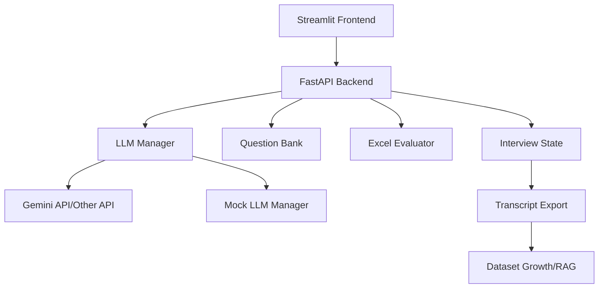
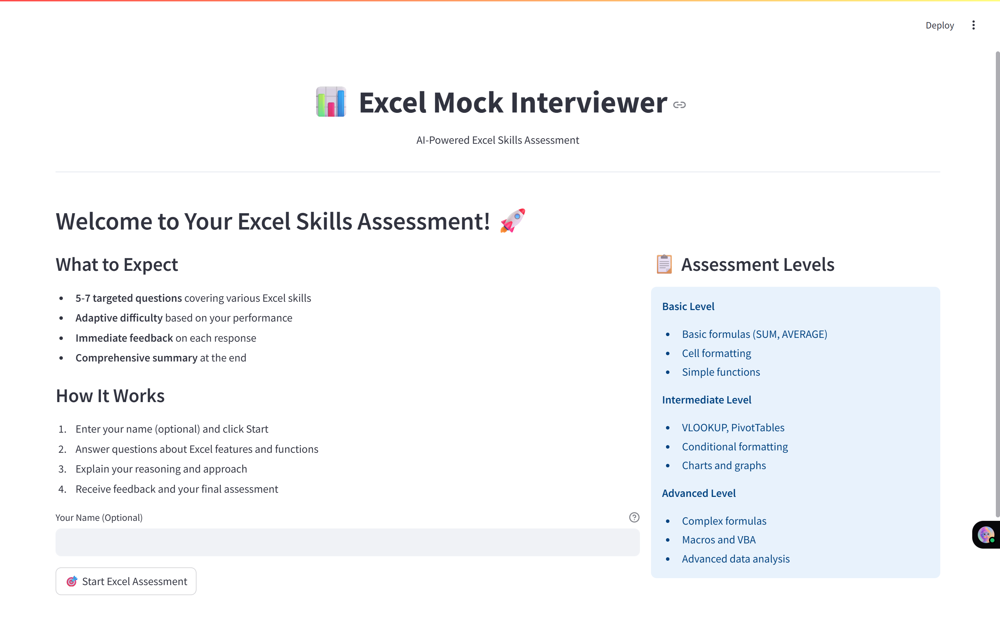

# 📊 Excel Mock Interviewer

**An intelligent AI-powered interview system for Microsoft Excel skills assessment with adaptive questioning, automated evaluation, and comprehensive feedback reporting.**

[](https://python.org)
[](https://fastapi.tiangolo.com)
[](https://streamlit.io)
[](https://ai.google.dev)

---

## 🎯 Project Overview

This project implements a **modern, web-based Excel skills interviewer** that conducts structured technical interviews, evaluates candidate responses using advanced LLM-based rubrics, and provides detailed performance feedback. Built with production-ready architecture supporting future dataset growth and RAG (Retrieval-Augmented Generation) capabilities.

## 🎬 Demo Link

[](https://drive.google.com/file/d/1ZctFA3yOwnh2vhEoUwi9Kpf4lGdZKVK2/view?usp=sharing)

*(Click the badge above to view the full video demo.)*

### Core Capabilities

- **🤖 Intelligent Interviewing:** AI-driven conversation flow with adaptive difficulty adjustment
- **📊 Automated Evaluation:** Multi-dimensional scoring (accuracy, explanation, efficiency)
- **🎯 Adaptive Questioning:** Dynamic difficulty progression based on candidate performance
- **📋 Comprehensive Reporting:** Detailed feedback with actionable improvement recommendations
- **💾 Export & Growth:** Interview transcript export for dataset building and RAG preparation
- **🧪 Development-Friendly:** Mock LLM mode for quota-free testing and development

---

## 🏗️ Architecture



### Technology Stack

| Component | Technology | Justification |
|-----------|------------|---------------|
| **Frontend** | Streamlit | Rapid prototyping, built-in chat components, easy deployment |
| **Backend** | FastAPI | Modern async API, automatic documentation, type safety |
| **LLM Provider** | Google Gemini | Advanced reasoning, cost-effective, strong Excel domain knowledge |
| **Data Models** | Pydantic | Type safety, automatic validation, easy serialization |
| **State Management** | In-memory/File | Simple for MVP, easily scalable to databases |

---

## 🚀 Quick Start

### Prerequisites

- Python 3.9 or higher
- Google Gemini/Other API key (optional for development - mock mode available)

### Installation

1. **Clone the repository**

   ```bash
   git clone https://github.com/yourusername/excel-mock-interviewer.git
   cd excel-mock-interviewer
   ```

2. **Install dependencies**

   ```bash
   pip install -r requirements.txt
   ```

3. **Set up environment**

   ```bash
   cp .env.example .env
   # Edit .env with your configuration
   ```

4. **Configure Environment Variables**

   ```bash
   # For development (no API key needed)
   USE_MOCK_LLM=True
   
   # For production (requires Gemini API key)
   USE_MOCK_LLM=False
   GEMINI_API_KEY=your_gemini_api_key_here
   ```

### Running the Application

1. **Start the Backend**

   ```bash
   # Option 1: Direct execution
   python fastapi_backend.py
   
   # Option 2: With hot reload (recommended for development)
   uvicorn fastapi_backend:app --reload
   ```

2. **Start the Frontend** (in a new terminal)

   ```bash
   streamlit run streamlit_frontend.py
   ```

3. **Access the Application**
   - Frontend: <http://localhost:8501>
   - API Documentation: <http://localhost:8000/docs>

---

## 📋 Features

### Interview Flow

- **Professional Introduction:** Personalized welcome and process explanation
- **Adaptive Questioning:** 5-7 questions with dynamic difficulty adjustment
- **Real-time Feedback:** Immediate evaluation and constructive guidance
- **Comprehensive Summary:** Detailed performance report with recommendations

### Evaluation System

- **Multi-Dimensional Scoring:**
  - **Accuracy (40%):** Technical correctness of Excel knowledge
  - **Explanation (30%):** Quality of reasoning and communication
  - **Efficiency (30%):** Optimal approach and best practices

- **Difficulty Levels:**
  - **Basic:** SUM, AVERAGE, formatting, basic functions
  - **Intermediate:** VLOOKUP, PivotTables, charts, conditional formatting
  - **Advanced:** Complex formulas, macros, VBA, advanced data analysis

### Development Features

- **Mock LLM Mode:** Zero-cost development and testing
- **Hot Reload:** Instant updates during development
- **Comprehensive Logging:** Detailed operation tracking
- **Error Handling:** Graceful degradation and user-friendly error messages

---

## 🔧 Configuration

### Environment Variables

| Variable | Default | Description |
|----------|---------|-------------|
| `USE_MOCK_LLM` | `True` | Enable mock responses for development |
| `GEMINI_API_KEY` | `""` | Google Gemini API key |
| `LLM_MODEL` | `gemini-1.5-pro` | Gemini model version |
| `LLM_TEMPERATURE` | `0.1` | Model creativity (0.0-1.0) |
| `API_HOST` | `localhost` | Backend host |
| `API_PORT` | `8000` | Backend port |
| `STREAMLIT_PORT` | `8501` | Frontend port |

### Adaptive Difficulty Settings

```python
DIFFICULTY_PROGRESSION = {
    "basic_to_intermediate_threshold": 7.0,
    "intermediate_to_advanced_threshold": 8.0,
    "regression_threshold": 5.0,
    "max_consecutive_wrong": 2
}
```

---

## 📊 Data Export & Dataset Growth

### Interview Transcript Export

Every completed interview automatically generates a detailed JSON transcript containing:

- **Session metadata:** ID, candidate name, timestamps, duration
- **Question history:** All questions asked with context
- **Answer records:** Complete candidate responses with timestamps
- **Evaluation details:** Scores, feedback, rubric breakdown
- **Performance metrics:** Skill breakdown, difficulty progression

### Example Export Structure

```json
{
  "session_id": "uuid-here",
  "candidate_name": "John Doe",
  "start_time": "2024-01-15T10:00:00",
  "questions_asked": ["basic_001", "inter_001"],
  "answers": [
    {
      "question_id": "basic_001",
      "response": "I would use =SUM(A1:A10) to calculate the total",
      "timestamp": "2024-01-15T10:02:30"
    }
  ],
  "evaluations": [
    {
      "accuracy_score": 0.9,
      "explanation_score": 0.8,
      "efficiency_score": 0.85,
      "feedback": "Excellent use of SUM function...",
      "strengths": ["Correct formula", "Clear explanation"],
      "improvement_areas": ["Consider error handling"]
    }
  ]
}
```

### RAG Pipeline Readiness

The exported data structure is designed for easy integration with RAG systems:

- **Structured Format:** JSON schema perfect for vector database ingestion
- **Rich Context:** Question-answer-feedback triplets ideal for similarity search
- **Metadata Rich:** Skill categories, difficulty levels, performance metrics
- **Scalable:** File-based storage easily migrates to databases/cloud storage

---

## 🎨 User Interface

### Main Interview Interface

- **Clean Chat Design:** Professional conversation flow
- **Real-time Progress:** Visual progress tracking and difficulty indicators
- **Performance Dashboard:** Live scoring and skill breakdown
- **Export Options:** One-click transcript download

### Development Interface

- **Mock Mode Indicator:** Clear visual feedback when using mock responses
- **Backend Status:** Connection monitoring and health checks
- **Debug Information:** Comprehensive logging and error reporting

---

## 🧪 Development & Testing

### Mock LLM Mode

For development and testing without API costs:

```bash
# Enable mock mode in .env
USE_MOCK_LLM=True
```

Features:

- **Intelligent Responses:** Context-aware mock feedback based on question type
- **Realistic Scoring:** Performance-based evaluation simulation
- **Zero Cost:** No API calls or quota consumption
- **Instant Response:** No network latency for rapid testing

### Testing Strategies

1. **Functional Testing:** Complete interview flows with various answer types
2. **Performance Testing:** Mock mode allows unlimited testing iterations
3. **Integration Testing:** Backend/frontend communication validation
4. **User Experience Testing:** Multi-device and browser compatibility

---

## 🛣️ Roadmap & Extensions

### Phase 1: Current MVP

- ✅ Structured interview flow
- ✅ Automated evaluation
- ✅ Adaptive difficulty
- ✅ Export capabilities

### Phase 2: Dataset & RAG Integration

- 🔄 Interview transcript analysis
- 🔄 RAG-powered question generation
- 🔄 Performance pattern recognition
- 🔄 Personalized learning paths

### Phase 3: Enterprise Features

- 📋 Multi-user management
- 📋 Advanced analytics dashboard
- 📋 Custom rubric creation
- 📋 Integration APIs

---

## 🤝 Contributing

1. Fork the repository
2. Create a feature branch (`git checkout -b feature/amazing-feature`)
3. Make your changes
4. Add tests if applicable
5. Commit your changes (`git commit -m 'Add amazing feature'`)
6. Push to the branch (`git push origin feature/amazing-feature`)
7. Open a Pull Request

### Development Setup

```bash
# Install development dependencies
pip install -r requirements-dev.txt

# Run tests
python -m pytest

# Format code
black .

# Lint code
flake8 .
```

---

## 🐛 Troubleshooting

### Common Issues

**Backend won't start:**

- Check if port 8000 is available
- Verify Python version compatibility
- Review logs for specific error messages

**Frontend connection errors:**

- Ensure backend is running first
- Check `API_BASE_URL` in settings
- Verify no firewall blocking

**Mock mode not working:**

- Confirm `USE_MOCK_LLM=True` in .env
- Restart both backend and frontend
- Check for import errors in mock manager

**Gemini API errors:**

- Verify API key is correct and has quota
- Check network connectivity
- Review rate limiting settings

---

## 📄 License

This project is licensed under the MIT License - see the [LICENSE](LICENSE) file for details.

---

## 🙏 Acknowledgments

- **Google Gemini AI** for advanced language model capabilities
- **FastAPI** and **Streamlit** communities for excellent frameworks
- **Pydantic** for robust data validation and serialization
- Open source community for inspiration and best practices

---

## 📸 Screenshot

### Welcome & Setup



## 📞 Contact

For questions, suggestions, or collaboration opportunities:

- **GitHub Issues:** [Create an issue](https://github.com/dshail/excel-mock-interviewer/issues)
- **Email:** <dhakadshailendra220@gmail.com>
- **LinkedIn:** [shailendra-dhakad-dshail](https://www.linkedin.com/in/shailendra-dhakad-dshail)

---

**Built with ❤️ for Excel education and AI-powered innovation.**
